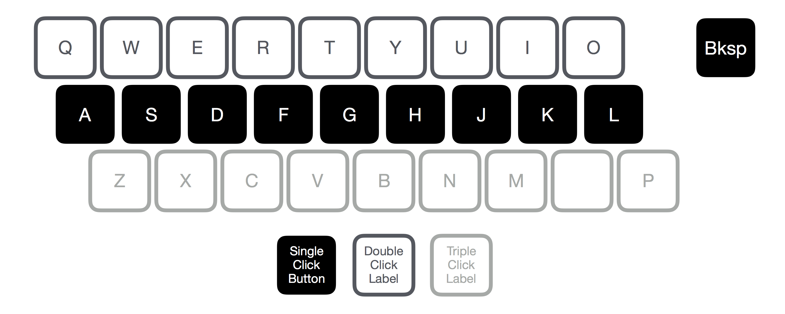

#Text entry using a custom 10 switch keyboard
Code and documentation for processing inputs from 10 pushbuttons and converting them to all 26 characters, space, and backspace. 

Text Entry Technique
--------------------
I decided to adapt the [E.161 Multi-tap](https://en.wikipedia.org/wiki/E.161) system for the layout of a traditional querty keyboard, because I have worked on computers in the past and wanted to design my own keyboard. I decided to keep the middle ASDFGHJKL row, and have each one of these characters be double and triple clickable, in a similar manner to the E.161 system. I used the following key mapping, where "Sp" is space and "Bksp" is backspace:

The main downside of this mapping is that the space key requires triple clicking the K key. 

I arranged keys like a traditional keyboard, where only the middle row and backspace keys are clickable, and the top and bottom rows are just labels. I shifted the P key to the bottom row to illustrate that it was a triple click.

How the Code works
------------------
The code for the keyboard is fairly simple. There are four configurable values, as folows: 

Name         | Default Value (in ms) | Description
------------:|:---------------------:|:-----
debounceTime | 20                    | time to delay between loops to account for button debounce
clickTimeout | 400                   | time to wait between successive clicks of same button before timing out and logging a click
holdTime     | 1000                  | time before a held key is logged
bkspHold     | 200                   | time between successive backspaces when button is held

There are three arrays that store values related to each key:
  * buttonState: the digital value of each button (high or low), measured once per loop
  * clickState: the state of the click, as part of the finite state machine described below
  * clickTime: the elapsed time since the most recent button release

For detecting and processing button presses, I made a modified version of the [OneButton Library](https://github.com/mathertel/OneButton) for my wiring layout and triple click capability. I implemented a finite state machine to properly navigate between the different states of pressing the button, releasing it, and waiting for more clicks or logging a click. 

On each loop, a specific action is performed depending on what state the machine is on. A detailed explanation of these actions can be found [here](http://www.mathertel.de/Arduino/OneButtonLibrary.aspx). 

Here is a diagram of the state machine, as well as a description of each state:

State         | Description 
------------:|:-------------------
0            | Wait for first button click
1            | Button clicked for first time, wait for release or timeout
2            | Button released from first click, wait for second click or timeout
3            | Button clicked for second time, wait for release or timeout
4            | Button released from second click, wait for third click or timeout
5            | Button clicked for third time, wait for release or timeout
6            | Button released from third click
7            | Button held on first click
8            | Button held on second click
9            | Button held on third click

Construction
------------
The keyboard is constructed from clear cast acrylic and birch plywood, and was manufactured on a lasercutter. Two acrylic layers form the baseplate and hold the switches and wiring, and the wood layers provide the main housing for the keys, as well as the cosmetic face. 

Here is a simplified cross section of the keyboard, showing how the keys interact with the pushbuttons: 

Bill of Materials
-----------------
 * RedBear Duo Microcontroller
 * 10x Momentary Tactile Switches (TE FSM6JH at Mouser or 450-1650-ND at Digikey)
 * Perfboard
 * Solder-on female headers
 * 0.25" Russian Birch Plywood
 * 0.125" Russian Birch Plywood
 * M3x16 screws
 * M3 nuts

Wiring
------
The wiring diagram of the keyboard is shown below:

Reflection
----------

Video
-----
Here's a demo of me typing "HELLO WORLD"

